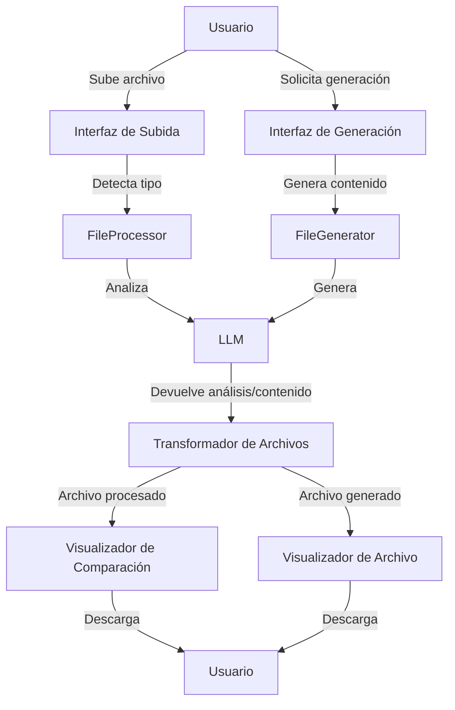

# Integración de Procesamiento de Archivos en MetanoIA

## Introducción

Este documento describe una propuesta para extender las capacidades actuales de generación de archivos de MetanoIA, añadiendo funcionalidades para procesar archivos existentes. Esta extensión permitirá que el sistema no solo genere archivos en diferentes formatos, sino que también pueda leer, analizar y transformar archivos subidos por el usuario.

## Objetivos

1. Mantener la coherencia con la filosofía educativa de MetanoIA
2. Integrar el procesamiento de archivos con el flujo actual de generación
3. Soportar los mismos formatos que ya se pueden generar (JSON, Python, Markdown, TXT, CSV, HTML, CSS, JS, Excel)
4. Implementar una lógica centralizada y sin redundancias
5. Manejar eficientemente archivos de diferentes tamaños

## Arquitectura Propuesta

### 1. Extensión del Sistema Actual

La arquitectura actual de generación de archivos se basa en:
- `FileGenerator` en `src/api/file_generator.py` (backend)
- Componentes de UI en `src/components/file_generator.py` (frontend)

Proponemos extender este sistema manteniendo la misma estructura modular:

```
src/
├── api/
│   ├── file_generator.py     → Añadir métodos de procesamiento
│   └── file_processor.py     → Nuevo módulo para procesamiento específico
├── components/
│   ├── file_generator.py     → Extender para incluir UI de procesamiento
│   └── file_processor.py     → Nuevo componente para UI de procesamiento
└── utils/
    └── file_utils.py         → Funciones auxiliares compartidas
```

### 2. Modelo de Datos y Flujo

#### Flujo de Procesamiento

1. **Subida de archivo**: El usuario sube un archivo a través de la interfaz
2. **Detección de tipo**: El sistema detecta automáticamente el tipo de archivo
3. **Análisis preliminar**: Se realiza un análisis inicial del contenido y estructura
4. **Procesamiento por LLM**: El modelo de lenguaje analiza el archivo y sugiere transformaciones
5. **Transformación**: Se aplican las transformaciones sugeridas
6. **Visualización**: Se muestra una comparación entre el archivo original y el procesado
7. **Descarga**: El usuario puede descargar el archivo procesado

#### Integración con el Flujo Actual



## Implementación Técnica

### 1. Extensión de `FileGenerator`

Añadir métodos para procesar archivos existentes:

```python
def process_file(self, file_content: Any, file_type: str, processing_options: Dict[str, Any] = None) -> Dict[str, Any]:
    """
    Procesa un archivo existente según su tipo y opciones especificadas.
    
    Args:
        file_content: Contenido del archivo a procesar.
        file_type: Tipo de archivo (json, python, markdown, etc.).
        processing_options: Opciones específicas para el procesamiento.
        
    Returns:
        Dict[str, Any]: Información del archivo procesado.
    """
    # Verificar que el tipo de archivo esté soportado
    if file_type not in FILE_TYPES:
        error_msg = f"Tipo de archivo no soportado para procesamiento: {file_type}"
        if self.logger:
            self.logger.error(error_msg)
        return {"success": False, "error": error_msg}
    
    # Procesar según el tipo de archivo
    try:
        processed_content = None
        
        if file_type == 'json':
            processed_content = self._process_json_file(file_content, processing_options)
        elif file_type == 'csv':
            processed_content = self._process_csv_file(file_content, processing_options)
        # ... otros tipos
        
        # Generar archivo con el contenido procesado
        result = self.generate_file(processed_content, f"processed_{datetime.now().strftime('%Y%m%d%H%M%S')}", file_type)
        
        # Añadir metadatos de procesamiento
        result["original_content"] = file_content
        result["processing_options"] = processing_options
        
        return result
        
    except Exception as e:
        error_msg = f"Error al procesar archivo {file_type}: {str(e)}"
        if self.logger:
            self.logger.error(error_msg)
            self.logger.exception("Detalles del error:")
        
        return {
            "success": False,
            "error": error_msg
        }
```

### 2. Manejo de Archivos Grandes

Para archivos grandes, implementaremos:

1. **Procesamiento por fragmentos**:
   - Dividir archivos grandes en fragmentos manejables
   - Procesar cada fragmento por separado
   - Combinar los resultados

2. **Streaming de archivos**:
   - Usar `io.StringIO` o `io.BytesIO` para archivos en memoria
   - Implementar procesamiento en streaming para CSV y otros formatos tabulares

```python
def _process_large_file(self, file_path: str, chunk_size: int = 1024*1024, 
                        processor_func: callable = None) -> Any:
    """
    Procesa un archivo grande por fragmentos.
    
    Args:
        file_path: Ruta al archivo a procesar.
        chunk_size: Tamaño de cada fragmento en bytes.
        processor_func: Función para procesar cada fragmento.
        
    Returns:
        Any: Resultado combinado del procesamiento.
    """
    results = []
    
    with open(file_path, 'rb') as f:
        while True:
            chunk = f.read(chunk_size)
            if not chunk:
                break
                
            # Procesar el fragmento
            if processor_func:
                result = processor_func(chunk)
                results.append(result)
    
    # Combinar resultados
    return self._combine_results(results)
```

### 3. Procesadores Específicos por Tipo de Archivo

Implementaremos procesadores específicos para cada tipo de archivo soportado:

#### JSON

```python
def _process_json_file(self, content: Dict[str, Any], options: Dict[str, Any] = None) -> Dict[str, Any]:
    """
    Procesa un archivo JSON.
    
    Operaciones posibles:
    - Formateo y embellecimiento
    - Filtrado de campos
    - Transformación de valores
    - Validación contra esquema
    """
    options = options or {}
    
    # Formatear JSON
    if options.get('format', True):
        # Ya está en formato de diccionario, no necesita parsing
        pass
        
    # Filtrar campos
    if 'filter_fields' in options:
        content = self._filter_json_fields(content, options['filter_fields'])
        
    # Transformar valores
    if 'transformations' in options:
        content = self._transform_json_values(content, options['transformations'])
        
    # Validar contra esquema
    if 'schema' in options:
        self._validate_json_schema(content, options['schema'])
        
    return content
```

#### CSV

```python
def _process_csv_file(self, content: List[List[Any]], options: Dict[str, Any] = None) -> List[List[Any]]:
    """
    Procesa un archivo CSV.
    
    Operaciones posibles:
    - Filtrado de filas/columnas
    - Transformación de valores
    - Agregación de datos
    - Ordenamiento
    """
    options = options or {}
    
    # Convertir a DataFrame para facilitar el procesamiento
    import pandas as pd
    
    # Determinar si es una lista de listas o una lista de diccionarios
    if content and isinstance(content[0], dict):
        df = pd.DataFrame(content)
    else:
        df = pd.DataFrame(content[1:], columns=content[0] if content else None)
    
    # Filtrar filas
    if 'filter_rows' in options:
        query = options['filter_rows']
        df = df.query(query) if query else df
    
    # Filtrar columnas
    if 'select_columns' in options:
        columns = options['select_columns']
        df = df[columns] if columns else df
    
    # Ordenar
    if 'sort_by' in options:
        sort_by = options['sort_by']
        ascending = options.get('ascending', True)
        df = df.sort_values(by=sort_by, ascending=ascending)
    
    # Transformar a formato original
    if content and isinstance(content[0], dict):
        return df.to_dict('records')
    else:
        return [df.columns.tolist()] + df.values.tolist()
```

### 4. Componente de UI para Procesamiento

Extenderemos la interfaz de usuario para incluir opciones de procesamiento:

```python
def display_file_processor():
    """
    Muestra la interfaz para procesar archivos.
    """
    st.subheader("Procesador de Archivos")
    
    uploaded_file = st.file_uploader("Subir archivo para procesar", 
                                    type=["json", "csv", "txt", "md", "py", "html", "css", "js", "xlsx"])
    
    if uploaded_file is not None:
        # Detectar tipo de archivo
        file_type = detect_file_type(uploaded_file)
        
        st.info(f"Archivo detectado: {uploaded_file.name} (Tipo: {file_type})")
        
        # Mostrar opciones específicas según el tipo de archivo
        processing_options = {}
        
        if file_type == "json":
            st.subheader("Opciones de procesamiento JSON")
            processing_options["format"] = st.checkbox("Formatear JSON", value=True)
            processing_options["filter_fields"] = st.text_input("Campos a incluir (separados por coma)")
            
        elif file_type == "csv":
            st.subheader("Opciones de procesamiento CSV")
            processing_options["filter_rows"] = st.text_input("Filtro de filas (expresión)")
            processing_options["select_columns"] = st.text_input("Columnas a incluir (separadas por coma)")
            processing_options["sort_by"] = st.text_input("Ordenar por columna")
            
        # ... opciones para otros tipos de archivo
        
        # Botón para procesar
        if st.button("Procesar archivo"):
            with st.spinner("Procesando archivo..."):
                # Leer contenido del archivo
                file_content = read_file_content(uploaded_file, file_type)
                
                # Procesar archivo
                result = file_processor.process_file(file_content, file_type, processing_options)
                
                if result.get("success", False):
                    # Mostrar comparación
                    display_file_comparison(result["original_content"], result["processed_content"], file_type)
                    
                    # Mostrar botón de descarga
                    display_file_download(result)
                else:
                    st.error(f"Error al procesar el archivo: {result.get('error', 'Error desconocido')}")
```

### 5. Visualización de Comparación

Implementaremos un componente para comparar el archivo original con el procesado:

```python
def display_file_comparison(original_content, processed_content, file_type):
    """
    Muestra una comparación entre el contenido original y el procesado.
    """
    st.subheader("Comparación")
    
    col1, col2 = st.columns(2)
    
    with col1:
        st.markdown("**Archivo Original**")
        display_content_preview(original_content, file_type)
        
    with col2:
        st.markdown("**Archivo Procesado**")
        display_content_preview(processed_content, file_type)
```

## Manejo de Errores y Seguridad

### Validación de Archivos

Implementaremos validaciones de seguridad para los archivos subidos:

1. **Verificación de tamaño**: Limitar el tamaño máximo de los archivos
2. **Validación de contenido**: Verificar que el contenido corresponda al tipo declarado
3. **Sanitización**: Eliminar contenido potencialmente peligroso

```python
def validate_uploaded_file(uploaded_file, max_size_mb=20):
    """
    Valida que un archivo subido cumpla con los requisitos de seguridad.
    
    Args:
        uploaded_file: Archivo subido por el usuario.
        max_size_mb: Tamaño máximo permitido en MB.
        
    Returns:
        tuple: (bool, str) - Validez y mensaje de error si aplica.
    """
    try:
        # Verificar que el archivo existe
        if uploaded_file is None:
            return False, "No se ha subido ningún archivo"
        
        # Verificar el tamaño
        file_size_mb = uploaded_file.size / (1024 * 1024)
        if file_size_mb > max_size_mb:
            return False, f"El archivo es demasiado grande: {file_size_mb:.2f}MB (máximo {max_size_mb}MB)"
        
        # Verificar el tipo de archivo
        file_type = detect_file_type(uploaded_file)
        if file_type not in FILE_TYPES:
            return False, f"Tipo de archivo no soportado: {file_type}"
        
        # Validar el contenido según el tipo
        is_valid, error_msg = validate_file_content(uploaded_file, file_type)
        if not is_valid:
            return False, error_msg
        
        return True, ""
        
    except Exception as e:
        logger.error(f"Error al validar el archivo: {str(e)}")
        logger.exception("Detalles del error:")
        return False, f"Error al validar el archivo: {str(e)}"
```

## Integración con el Sistema de Manejo de Contexto

Una característica fundamental de MetanoIA es su capacidad para mantener el contexto de la conversación independientemente del modelo de lenguaje que se esté utilizando. Para integrar el procesamiento de archivos con este sistema, debemos asegurar que la información del archivo procesado se mantenga disponible en el contexto incluso cuando el usuario cambie de modelo.

### Arquitectura de Manejo de Contexto

El sistema actual de manejo de contexto en MetanoIA se basa en:

1. **Almacenamiento centralizado de mensajes**: Todos los mensajes se almacenan en una estructura común accesible por cualquier modelo.
2. **Serialización y deserialización de mensajes**: Los mensajes se convierten a un formato común que puede ser interpretado por cualquier modelo.
3. **Gestión de estado de sesión**: El estado de la sesión se mantiene independientemente del modelo activo.

### Integración del Procesamiento de Archivos en el Contexto

```python
def add_file_to_context(self, file_info: Dict[str, Any], conversation_context: List[Dict[str, Any]]) -> List[Dict[str, Any]]:
    """
    Añade la información de un archivo procesado al contexto de la conversación.
    
    Args:
        file_info: Información del archivo procesado.
        conversation_context: Contexto actual de la conversación.
        
    Returns:
        List[Dict[str, Any]]: Contexto actualizado.
    """
    # Crear un resumen del archivo para el contexto
    file_summary = {
        "type": "file_summary",
        "file_name": file_info.get("filename", "archivo_sin_nombre"),
        "file_type": file_info.get("file_type", "desconocido"),
        "content_summary": self._generate_file_summary(file_info),
        "timestamp": datetime.now().isoformat(),
        "file_id": file_info.get("file_id", str(uuid.uuid4()))
    }
    
    # Añadir el resumen como un mensaje del sistema en el contexto
    system_message = {
        "role": "system",
        "content": f"El usuario ha procesado un archivo: {file_summary['file_name']} (tipo: {file_summary['file_type']}). "
                  f"Resumen del contenido: {file_summary['content_summary']}"
    }
    
    # Almacenar los detalles completos en el estado de la sesión
    st.session_state.processed_files = st.session_state.get("processed_files", {})
    st.session_state.processed_files[file_summary["file_id"]] = file_info
    
    # Añadir el mensaje al contexto
    conversation_context.append(system_message)
    
    return conversation_context

def _generate_file_summary(self, file_info: Dict[str, Any]) -> str:
    """
    Genera un resumen del contenido del archivo para incluir en el contexto.
    
    Args:
        file_info: Información del archivo procesado.
        
    Returns:
        str: Resumen del contenido del archivo.
    """
    file_type = file_info.get("file_type", "")
    content = file_info.get("content", None)
    
    if content is None:
        return "Contenido no disponible"
    
    # Generar resumen según el tipo de archivo
    if file_type == "json":
        return self._summarize_json(content)
    elif file_type == "csv":
        return self._summarize_csv(content)
    elif file_type == "txt" or file_type == "md":
        return self._summarize_text(content)
    # ... otros tipos
    
    return "Resumen no disponible para este tipo de archivo"
```

### Recomendaciones de Modelos para Procesamiento de Archivos

Cada tipo de archivo puede beneficiarse de diferentes capacidades de los modelos disponibles:

| Tipo de Archivo | Modelo Recomendado | Razón |
|-----------------|-------------------|-------|
| JSON            | Llama-3-70b       | Mejor comprensión de estructuras de datos complejas |
| CSV             | Claude-3-Opus     | Excelente para análisis tabular y estadístico |
| Código (Python, JS) | Llama-3-70b    | Mejor comprensión de sintaxis y patrones de código |
| Texto (TXT, MD) | Cualquiera        | Todos los modelos son adecuados para texto plano |
| Excel           | Claude-3-Opus     | Mejor para análisis de datos estructurados |

### Persistencia del Contexto al Cambiar de Modelo

Para asegurar que la información del archivo procesado se mantenga disponible al cambiar de modelo, implementaremos:

```python
def preserve_file_context_on_model_change(self, new_model: str) -> None:
    """
    Preserva el contexto de los archivos procesados al cambiar de modelo.
    
    Args:
        new_model: Nombre del nuevo modelo al que se está cambiando.
    """
    # Verificar si hay archivos procesados en la sesión
    if "processed_files" not in st.session_state:
        return
    
    # Obtener el contexto actual
    current_context = st.session_state.get("messages", [])
    
    # Verificar si necesitamos regenerar los resúmenes para el nuevo modelo
    if new_model in ["claude-3-opus", "claude-3-sonnet"]:
        # Formato específico para modelos Claude
        for file_id, file_info in st.session_state.processed_files.items():
            # Encontrar y actualizar los mensajes del sistema relacionados con este archivo
            for i, msg in enumerate(current_context):
                if msg.get("role") == "system" and f"file_id: {file_id}" in msg.get("content", ""):
                    # Actualizar el formato para Claude
                    current_context[i] = self._format_file_message_for_claude(file_info)
    
    # Actualizar el contexto en la sesión
    st.session_state.messages = current_context
```

## Integración con el Sistema de Herramientas

Para integrar con el sistema actual de herramientas de Groq, añadiremos definiciones para el procesamiento de archivos:

```python
def get_file_processing_tools_definitions(self) -> List[Dict[str, Any]]:
    """
    Obtiene las definiciones de herramientas para el procesamiento de archivos.
    
    Returns:
        List[Dict[str, Any]]: Lista de definiciones de herramientas.
    """
    tools = []
    
    # Generar definiciones para cada tipo de archivo soportado
    for file_type, config in FILE_TYPES.items():
        # Omitir tipos que requieren bibliotecas no disponibles
        if config.get('requires_library') and config['requires_library'] not in self.available_libraries:
            continue
            
        # Crear la definición de la herramienta
        tool = {
            "type": "function",
            "function": {
                "name": f"process_{file_type}_file",
                "description": f"Procesa un archivo {file_type.upper()} ({config['extension']}) subido por el usuario",
                "parameters": {
                    "type": "object",
                    "properties": {
                        "processing_options": {
                            "type": "object",
                            "description": f"Opciones para el procesamiento del archivo {file_type}"
                        }
                    },
                    "required": []
                }
            }
        }
        
        tools.append(tool)
    
    return tools
```

## Plan de Implementación

### Fase 1: Estructura Base

1. Crear el nuevo módulo `file_processor.py` en `src/api/`
2. Extender `FileGenerator` con métodos básicos de procesamiento
3. Implementar la detección automática de tipos de archivo
4. Crear la interfaz básica para subida y procesamiento

### Fase 2: Procesadores Específicos

1. Implementar procesadores para JSON y CSV (formatos más comunes)
2. Añadir opciones de procesamiento específicas para cada tipo
3. Desarrollar el componente de visualización de comparación
4. Implementar validaciones de seguridad

### Fase 3: Manejo de Archivos Grandes

1. Implementar procesamiento por fragmentos
2. Añadir soporte para streaming de archivos
3. Optimizar el rendimiento para archivos grandes
4. Implementar indicadores de progreso

### Fase 4: Integración con LLM

1. Extender el sistema de herramientas de Groq
2. Implementar análisis inteligente de archivos
3. Añadir sugerencias automáticas de procesamiento
4. Integrar con el historial de conversación

## Consideraciones Educativas

Siguiendo la filosofía de MetanoIA, esta implementación debe:

1. **Explicar cada paso**: Mostrar al usuario qué transformaciones se están aplicando
2. **Ser transparente**: Permitir ver el código generado para las transformaciones
3. **Ser didáctica**: Incluir comentarios y explicaciones en el código generado
4. **Ser progresiva**: Permitir diferentes niveles de complejidad según la experiencia del usuario

## Conclusión

Esta propuesta de integración de procesamiento de archivos mantiene la coherencia con la arquitectura actual de MetanoIA, añadiendo nuevas capacidades sin redundancia de código. El enfoque modular y extensible permitirá añadir soporte para más tipos de archivo y operaciones de procesamiento en el futuro, manteniendo siempre el enfoque educativo del proyecto.

La implementación seguirá las mejores prácticas de programación y se integrará perfectamente con el flujo actual de generación de archivos, proporcionando una experiencia unificada al usuario.
